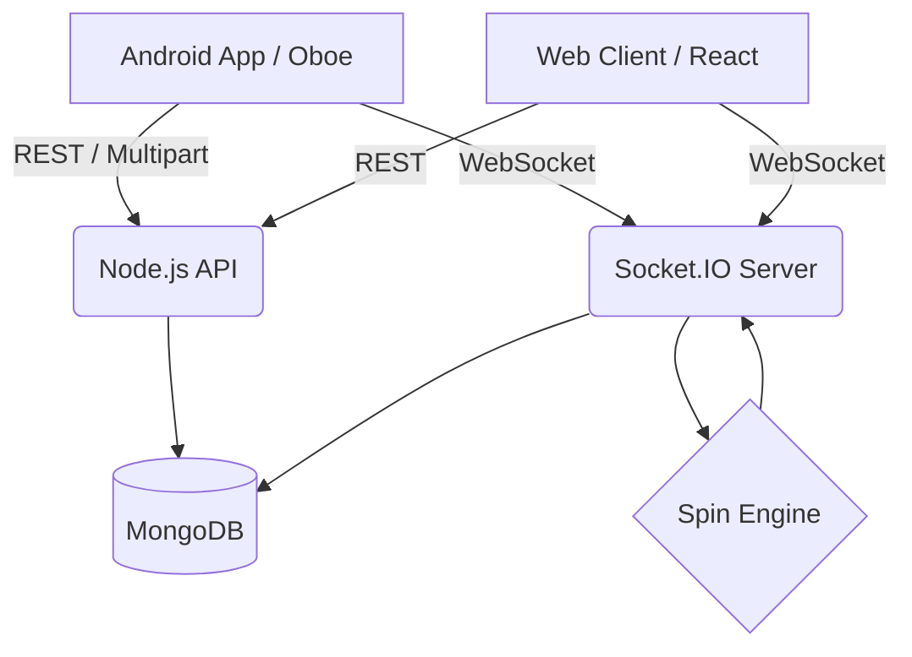
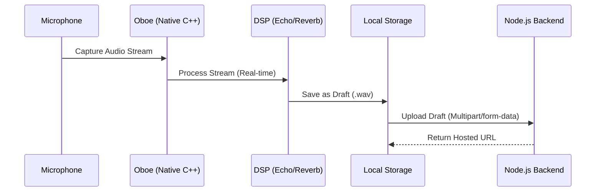
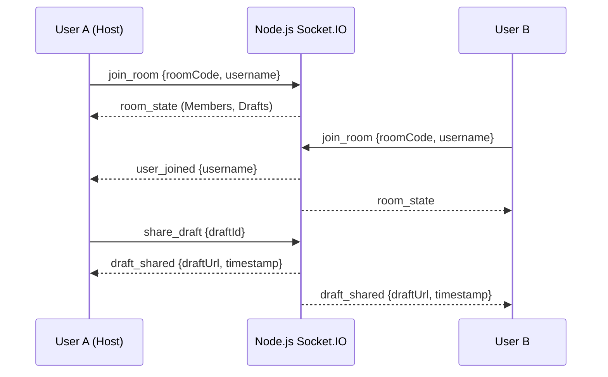
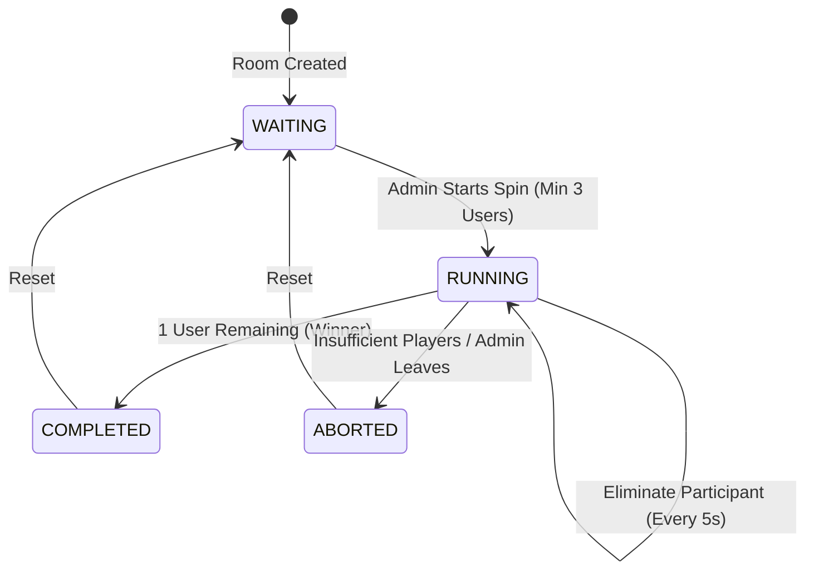

# 🎙️ Voice Draft, Room & Spin Wheel System

> **A unified platform for vocal artists to record, mix, and collaborate on voice drafts in private social rooms, featuring a multiplayer spin‑wheel arena!**

## 📖 Overview
This repository contains the complete implementation for the Voice Draft, Room & Spin Wheel System. It encompasses an Android audio studio utilizing Oboe, a real-time Node.js backend for room state and draft sharing, and a multiplayer spin wheel system.

## 🚀 Setup & Run Instructions

### Prerequisites
* **Node.js** v16+ (includes npm)
* **Docker** & **Docker Compose**
* **Git**
* **Android Studio** (for building the Android Oboe app)

### 1️⃣ Backend Local Development
```bash
cd backend
npm install
npm start   # Runs on http://localhost:5000
```
> Note: The backend uses an in-memory MongoDB instance for local development by default.

### 2️⃣ Frontend Local Development (React/Vite)
```bash
cd frontend
npm install
npm run dev   # Runs on http://localhost:5173
```

### 3️⃣ Android App
Open the `/android-app` folder in Android Studio. Build and run on a physical device or emulator. Microphone permissions will be requested on launch.

---

## 🧪 Testing

```bash
cd backend
npm install
npm test
```
The test suite utilizes Jest + Supertest and covers API contracts, WebSocket flows, room lifecycles, and spin-wheel logic (including eliminations and winner selection).

---

## ☁️ Deployment Instructions

The backend is fully containerized and can be deployed to any major cloud provider (AWS/GCP/Azure) using the provided Dockerfile.

### Local Docker Build
```bash
docker-compose up --build -d
```
This builds both frontend and backend and proxies requests automatically.

### Cloud Deployment (Example: Azure Web App for Containers)
1. Build the backend image: `docker build -t your-registry/voice-backend ./backend`
2. Push to your registry: `docker push your-registry/voice-backend`
3. Configure the container to run on port `5000`.
4. **Environment Variables**:
   * `NODE_ENV=production`
   * `MONGODB_URI=your_production_mongodb_connection_string`
   * `JWT_SECRET=your_secret_key` (if auth is added later)
5. **Health Check**: A `/health` endpoint is provided. Configure your cloud provider to ping `http://<your-domain>/health` to verify container health.

---

## 🏛️ System Architecture Diagram



---

## 🎵 Audio-Flow Diagram



---

## 🤝 Room and WebSocket Event-Flow Diagram



---

## 🎡 Spin State-Machine / Sequence Diagram



---

## ⚠️ Assumptions, Edge Cases, Trade-offs & Limitations

### Assumptions
* **Virtual Points:** Spin wheel rewards use virtual points stored in MongoDB. No actual financial or wallet transactions are modeled.
* **Audio Transcoding:** The Android app uploads standard WAV files. We assume standard network conditions where WAV file sizes are acceptable without heavy compression (like MP3/AAC), simplifying the native layer.

### Handled Edge Cases
* **Insufficient Players:** If a spin is initiated with fewer than 3 users, the server rejects the `start_spin` request.
* **User Disconnects During Spin:** If a user drops connection while `RUNNING`, they are removed from the eligible pool immediately. The elimination timer continues normally.
* **Admin Disconnects:** If the room owner leaves during a spin, the spin transitions to `ABORTED` to prevent orphaned game loops.

### Trade-offs
* **WebSocket over WebRTC:** We chose WebSocket (Socket.IO) for room state and event broadcasting. Since live audio streaming is out of scope (we are sharing recorded drafts), WebRTC is unnecessary overhead.
* **In-Memory DB vs. Managed DB:** For local development velocity, an in-memory MongoDB is used. The trade-off is data loss on restart, but the schema seamlessly scales to a managed MongoDB Atlas instance in production via the `MONGODB_URI` environment variable.

### Known Limitations
* **Audio Sync:** The `draft_shared` event triggers simultaneous playback, but absolute millisecond-perfect sync across global clients may vary due to differing network latencies.
* **Single Spin at a Time:** The architecture enforces a strict one-active-spin rule per room.